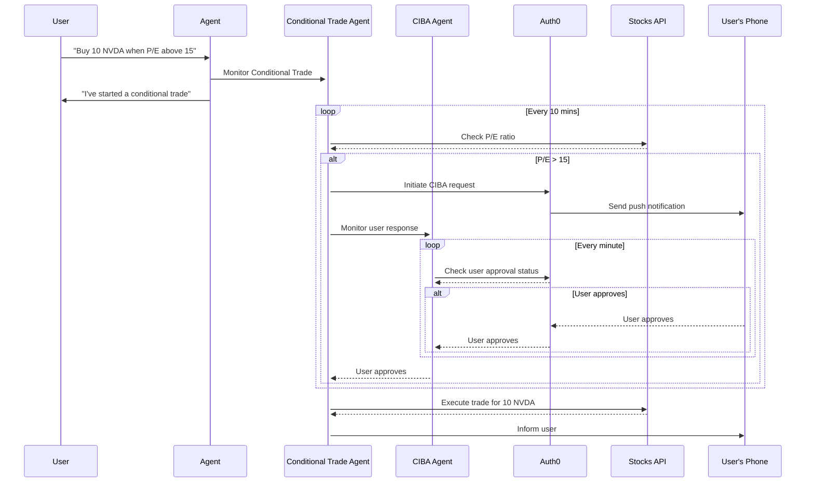

# Step Up Auth for Tools with LangChain

## Getting Started

### Prerequisites

- An OpenAI account and API key create one [here](https://platform.openai.com).
- An Auth0 account configured for CIBA.


### Process

`npm run dev` run several process in parallel. Here is an explanation of each one:

- **LangGraph**: The LangGraph server that will be run the graphs.
- **Scheduler**: This is a demo scheduler that works similar to [LangGraph Cron Jobs](https://langchain-ai.github.io/langgraph/cloud/how-tos/cron_jobs/).
- **API**: An API that is used in the demo.
- **GraphResumer**: A service that try to resume CIBA-interrupted graphs in the LangGraph server.

#### `.env` file

```sh
# Auth0
AUTH0_DOMAIN="<auth0-domain>"
AUTH0_CLIENT_ID="<auth0-client-id>"
AUTH0_CLIENT_SECRET="<auth0-client-secret>"

# API
API_URL=http://localhost:8081/
AUDIENCE=http://localhost:8081

# OpenAI
OPENAI_API_KEY="openai-api-key"

# Langchain
LANGGRAPH_API_URL="http://localhost:54367"

# Alternatively set a test user
TEST_USER_ID=...
```

### How to run it

1. Install dependencies. If you want to run with local dependencies follow root instructions.

   ```sh
   npm install
   ```

2. Run all components at once

   ```sh
   npm run dev
   ```

### How this works



## License

Apache-2.0
