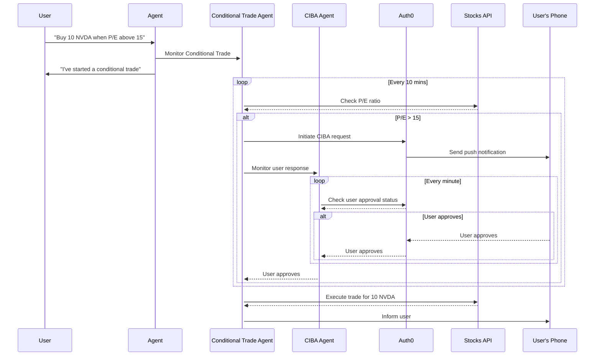

# Step Up Auth for Tools with LangChain

## Getting Started

### Prerequisites

- An OpenAI account and API key. You can create one [here](https://platform.openai.com).
  - [Use this page for instructions on how to find your OpenAI API key](https://help.openai.com/en/articles/4936850-where-do-i-find-my-openai-api-key)
- An **[Auth0](https://auth0.com)** account and the following settings and resources configured:
  - An application for CIBA with the following settings:
    - **Application Type**: `Web Application`
    - **Grant Type**: `CIBA` (or `urn:openid:params:grant-type:ciba`)
    - **Allowed Callback URL**: `http://localhost:5123/callback`
  - An API with the following settings:
    - **Name**: `Sample API`
    - **Identifier**: `sample-api`
    - **Permissions**: `stock:trade`
  - **Push Notifications** using [Auth0 Guardian](https://auth0.com/docs/secure/multi-factor-authentication/auth0-guardian) must be `enabled`
  - A test user enrolled in Guardian MFA.

### Setup the workspace `.env` file

Copy the `.env.example` file to `.env` and fill in the values for the following variables, using the settings obtained from the prerequisites:

```sh
# Auth0
AUTH0_DOMAIN="<auth0-domain>"
AUTH0_CLIENT_ID="<auth0-client-id>"
AUTH0_CLIENT_SECRET="<auth0-client-secret>"

# API
API_URL=http://localhost:8081/
AUDIENCE=sample-api

# OpenAI
OPENAI_API_KEY="openai-api-key"

# Langchain
LANGGRAPH_API_URL="http://localhost:54367"

```

### How to run it

1. Install dependencies. If you want to run with local dependencies follow root instructions.

   ```sh
   npm install
   ```

2. Run all components at once

   ```sh
   npm run dev
   ```

3. Starts the chatbot in another terminal:

   ```sh
   npm run chatbot
   ```

## How it works

### Detailed elements on this example

The command `npm run dev` runs several process in parallel. Here is an explanation of each one:

- **LangGraph**: The server responsible for executing and managing LangGraph-based graphs.
- **Scheduler**: A demo scheduler that replicates the behavior of [LangGraph Cron Jobs](https://langchain-ai.github.io/langgraph/cloud/how-tos/cron_jobs/).
- **API**: A demo API with endpoints that require specific authorization levels.
- **GraphResumer**: A service that attempts to resume threads interrupted during CIBA flows on the LangGraph server.

### Diagram

The following diagram shows the sequence of events that occur when a user requests a conditional trade:



## License

Apache-2.0
