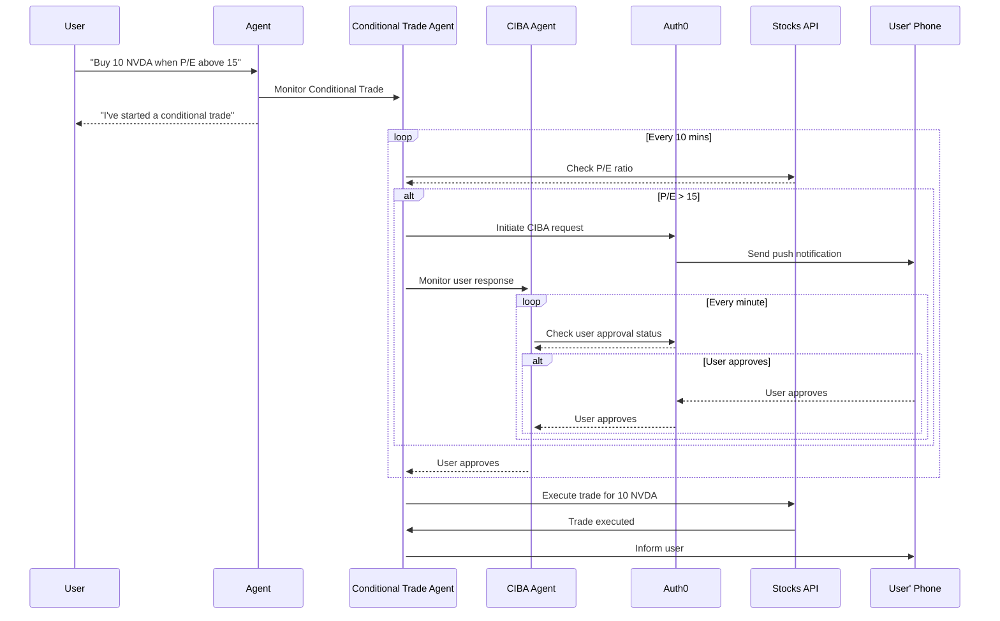

# Step Up Auth for Tools with LangChain

## Getting Started

#### `.env` file

```sh
# Auth0
AUTH0_DOMAIN="<auth0-domain>"
AUTH0_CLIENT_ID="<auth0-client-id>"
AUTH0_CLIENT_SECRET="<auth0-client-secret>"

# API
API_URL=http://localhost:8081/
AUDIENCE=http://localhost:8081

# OpenAI
OPENAI_API_KEY="openai-api-key"

# Langchain
LANGGRAPH_API_URL="http://localhost:54367"
```

### How to run it

1. Install dependencies. If you want to run with local dependencies follow root instructions.

   ```sh
   $ npm install
   ```

2. Running the API

   ```sh
   npm run start:api
   ```

3. Running the scheduler

   ```sh
   npm run scheduler:up
   ```

4. Running the example
   ```sh
   npm run dev
   ```

### How this works



## License

Apache-2.0
